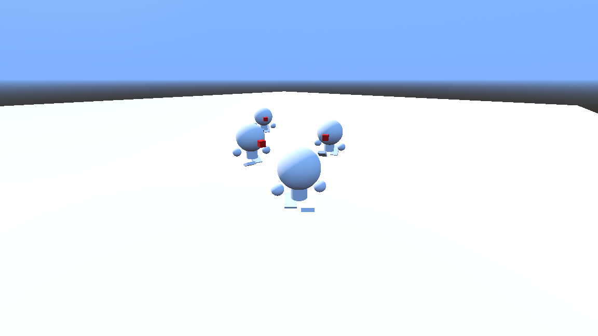

# Third Person Controller

## Description

This is a simple Third person controller template with animations, AI opponents, and other stuffs, where you can:

 - Moves by using WASD keys.

 - Jumps by using Spacebar or Z keys.

 - And Kicks your opponents by using RMB, SHIFT or Q keys.

## Usage

This is a template for **[Godot Engine](https://godotengine.org/)**, so for testing it you will need to install this game engine.

## Roadmap

 - [x] Make the template

## License

All details about the project's license you can find in **LICENSE** file in the game source folder. Or, you can check this 👉🏼 **https://mit-license.org/**

## Project status

Done! 👍🏼
